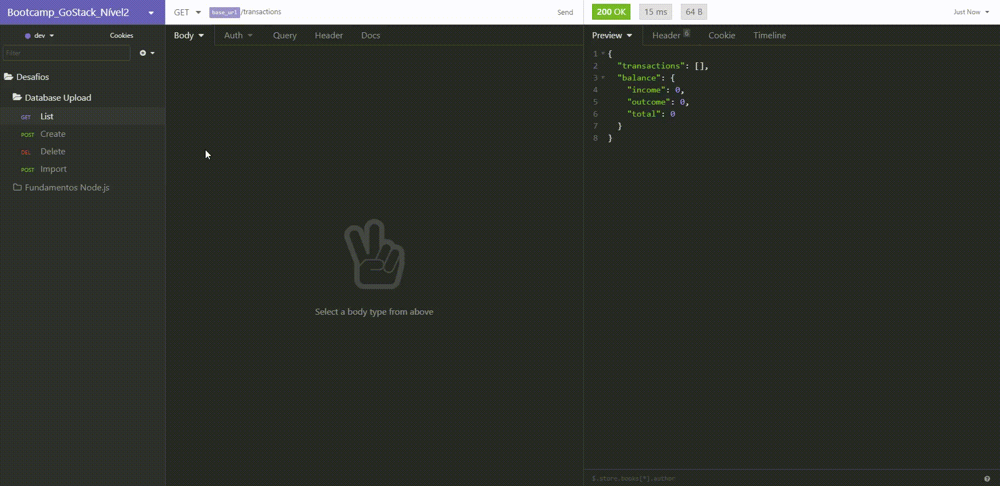
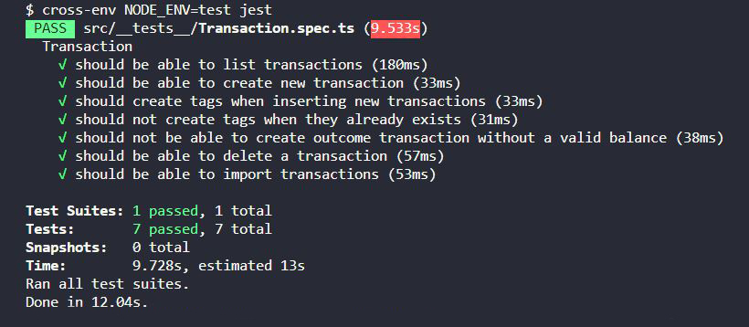

<h1 align="center">
  🚀 Database Upload 🚀
</h1>

<h3 align="center">
Desafio do Nível 2 sobre Database upload aplicado no bootcamp GoStack da Rocketseat
</h3>

<h1>
  
</h1>

## Índice

- [Sobre](#-sobre)
- [Tecnologia utilizada](#-tecnologia-utilizada)
- [Objetivos](#-objetivos)
- [Testes de Validação](#-testes-de-validação)
- [Para clonar e executar o projeto](#-para-clonar-e-executar-o-projeto)
- [Para executar o teste](#-para-executar-o-teste)
- [Importante](#-importante)

---

## 🔖 Sobre

O propósito deste Desafio é continuar a criação da aplicação que deve armazenar transações financeiras de entrada e saída e que deve permitir o cadastro e a listagem dessas transações. Aqui foi trabalhado tudo o que foi aprendido sobre **Node.js** junto ao **TypeScript**, mas dessa vez incluindo o uso de **banco de dados** (neste caso o PostgreSQL) com o **TypeORM** e envio de arquivos com o **Multer**!

---

## 🚀 Tecnologia utilizada

- [NodeJS](https://nodejs.org/en/)
- [TypeScript](https://www.typescriptlang.org/)
- [PostgreSQL](https://www.postgresql.org/)

---

## 🎯 Objetivos

Os objetivos deste desafio foram atingir os propósitos de cada rota:

- **POST /transactions:**
A rota deve receber `title`, `value`, `type`, e `category` dentro do corpo da requisição, sendo o `type` o tipo da transação, que deve ser `income` para entradas (depósitos) e `outcome` para saídas (retiradas). Ao cadastrar uma nova transação, ela deve ser armazenada dentro do banco de dados, possuindo os campos `id`, `title`, `value`, `type`, `category_id`, `created_at`, `updated_at`.<br/>
--- Para a categoria, uma nova tabela deve ser criada, que terá os campos `id`, `title`, `created_at`, `updated_at`.<br/>
--- Antes de criar uma nova categoria, é necessário verificar se já existe uma categoria com o mesmo título. Caso ela exista, use o `id` já existente no banco de dados.<br/>
As transações devem ser armazenadas dentro de um objeto seguindo o formato abaixo:
``` json
  {
    "id": "uuid",
  "title": "Salário",
  "value": 3000,
  "type": "income",
  "category": "Alimentação"
  }
```

- **GET /transactions:**
Essa rota deve retornar uma listagem com todas as transações cadastradas até o momento, junto com o valor de soma de entradas, retiradas e total de crédito. Essa rota deve retornar um objeto com o formato a seguir:
``` json
{
  "transactions": [
    {
      "id": "uuid",
      "title": "Salário",
      "value": 4000,
      "type": "income",
      "category": {
        "id": "uuid",
        "title": "Salary",
        "created_at": "2020-04-20T00:00:49.620Z",
        "updated_at": "2020-04-20T00:00:49.620Z"
      },
      "created_at": "2020-04-20T00:00:49.620Z",
      "updated_at": "2020-04-20T00:00:49.620Z"
    },
    {
      "id": "uuid",
      "title": "Freela",
      "value": 2000,
      "type": "income",
      "category": {
        "id": "uuid",
        "title": "Others",
        "created_at": "2020-04-20T00:00:49.620Z",
        "updated_at": "2020-04-20T00:00:49.620Z"
      },
      "created_at": "2020-04-20T00:00:49.620Z",
      "updated_at": "2020-04-20T00:00:49.620Z"
    },
    {
      "id": "uuid",
      "title": "Pagamento da fatura",
      "value": 4000,
      "type": "outcome",
      "category": {
        "id": "uuid",
        "title": "Others",
        "created_at": "2020-04-20T00:00:49.620Z",
        "updated_at": "2020-04-20T00:00:49.620Z"
      },
      "created_at": "2020-04-20T00:00:49.620Z",
      "updated_at": "2020-04-20T00:00:49.620Z"
    },
    {
      "id": "uuid",
      "title": "Cadeira Gamer",
      "value": 1200,
      "type": "outcome",
      "category": {
        "id": "uuid",
        "title": "Recreation",
        "created_at": "2020-04-20T00:00:49.620Z",
        "updated_at": "2020-04-20T00:00:49.620Z"
      },
      "created_at": "2020-04-20T00:00:49.620Z",
      "updated_at": "2020-04-20T00:00:49.620Z"
    }
  ],
  "balance": {
    "income": 6000,
    "outcome": 5200,
    "total": 800
  }
}
```

- **DELETE /transactions/:id :**
A rota deve deletar uma transação com o `id` presente nos parâmetros da rota;

- **POST /transactions/import:**
A rota deve permitir a importação de um arquivo com formato .csv contendo as mesmas informações necessárias para criação de uma transação `id`, `title`, `value`, `type`, `category_id`, `created_at`, `updated_at`, onde cada linha do arquivo CSV deve ser um novo registro para o banco de dados, e por fim retorne todas as transactions que foram importadas para seu banco de dados.
---

## 📝 Testes de Validação



Para que o desafio seja válido, a aplicação teve que passar por sete testes, que foram:

- **Seja possível criar uma nova transação:**
Para que esse teste passe, a aplicação deve permitir que uma transação seja criada, e retorne um json com a transação criado.

- **Seja possível criar tags ao inserir novas transações:**
Para que esse teste passe, a aplicação deve permitir que ao criar uma nova transação com uma categoria que não existe, essa seja criada e inserida no campo `category_id` da transação com o `id` que acabou de ser criado.

- **Não seja possível criar tags quando elas já existirem:**
Para que esse teste passe, a aplicação deve permitir que ao criar uma nova transação com uma categoria que já existe, seja atribuído ao campo `category_id` da transação com o `id` dessa categoria existente, não permitindo a criação de categorias com o mesmo `title`.

- **Seja possível listar as transações:**
Para que esse teste passe, a aplicação deve permitir que seja retornado um array de objetos contendo todas as transações junto ao balanço de `income`, `outcome` e `total` das transações que foram criadas até o momento.

- **Não seja possível criar uma transação sem um saldo válido:**
Para que esse teste passe, a aplicação não deve permitir que uma transação do tipo `outcome` extrapole o valor total que o usuário tem em caixa (total de income), retornando uma resposta com código HTTP 400 e uma mensagem de erro no seguinte formato: `{ error: string }`.

- **Seja possível deletar uma transação:**
Para que esse teste passe, a aplicação deve permitir que a rota de delete exclua uma transação, e ao fazer a exclusão, ele retorne uma resposta vazia, com status 204.

- **Seja possível importar uma transação:**
Para que esse teste passe, a aplicação deve permitir que seja importado um arquivo csv. Com o arquivo importado, você ela deve permitir que seja criado no banco de dados todos os registros e categorias que estavam presentes nesse arquivo, e retornar todas as transactions que foram importadas.

---

## ⚙ Para clonar e executar o projeto

```bash
  # clonar o projeto
  $ git clone https://github.com/DigooDS/database-upload.git

  # acessar o projeto
  $ cd database-upload

  # para instalar todas as dependências
  $ yarn

  # para iniciar o servidor (back-end)
  $ yarn dev:server

```

---

## 🛠 Para executar o teste

```bash
  $ yarn test
```
---

## 📌 Importante

Configurar a porta do banco de dados dentro do arquivo "ormconfig.json".
---

<i>Desenvolvido por RodrigoDS</i> 🤓
